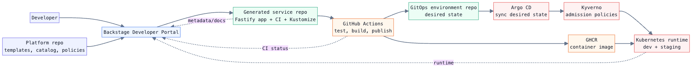

# GitOps Developer Platform

An internal developer platform that turns new-service creation into a repeatable golden path.

Backstage scaffolds a service repo, GitHub Actions builds and publishes the image, CI updates a separate GitOps environment repo, Argo CD deploys to Kubernetes, Kyverno enforces guardrails, and Backstage shows ownership, docs, CI/CD, and runtime status.

This project is not "just another app". It shows how a platform team can make service creation and delivery consistent instead of asking every engineer to wire up CI, deployment config, ownership, docs, and runtime visibility by hand.

## Project Highlights

- Built a local internal developer platform with `Backstage`, `Kubernetes`, `Argo CD`, `GitHub Actions`, `GHCR`, `Kustomize`, and `Kyverno`.
- Created a golden path `Node API` template that scaffolds a production-shaped Fastify service with tests, Dockerfile, CI, catalog metadata, TechDocs, and Kubernetes manifests.
- Implemented a GitOps delivery flow where service CI writes desired state to a separate environment repo and Argo CD deploys the change.
- Added Kubernetes guardrails with Kyverno for required labels, GHCR-only images, health probes, resource requests/limits, and non-root containers.
- Customized Backstage with catalog seed data, scaffolder integration, TechDocs, GitHub Actions visibility, and Kubernetes runtime visibility.

## What Problem This Solves

Without an internal platform, every new service requires repeated setup for CI, deployment, docs, and ownership.

This project turns that into a standard flow:

1. Create a service in Backstage.
2. Generate the repo and metadata.
3. Build and publish with GitHub Actions.
4. Update the GitOps repo.
5. Deploy with Argo CD.
6. Enforce guardrails with Kyverno.
7. View status in Backstage.

## Architecture



### Control Plane

- `Backstage` is the developer portal where engineers create services
- `Software Catalog` stores ownership, system, and runtime metadata
- `Scaffolder` publishes service repositories from approved templates
- `TechDocs` keeps generated service documentation close to code

### Delivery Plane

- `GitHub Actions` tests the service, builds the image, and publishes to `GHCR`
- the same workflow commits deployment desired state to the GitOps environment repo
- the GitOps repo stores Kustomize overlays and Argo CD `Application` manifests

### Runtime Plane

- `Argo CD` watches the GitOps repo and reconciles the cluster to the desired state
- `Kyverno` evaluates incoming manifests before workloads are admitted
- `Kubernetes` runs the resulting `dev` and `staging` workloads

### Governance Plane

- `Kyverno` enforces workload guardrails in app namespaces
- policy failures are surfaced as part of the platform workflow instead of becoming tribal knowledge

### Visibility Plane

- `catalog-info.yaml` and TechDocs flow back into the Backstage service page
- GitHub Actions run status is shown in Backstage
- Kubernetes runtime objects are surfaced back to service owners

## Repository Roles

This project is designed around three repo types:

### 1. Platform Repo

This repository, `gitops-developer-platform`, is the platform repo.

It owns:

- Backstage source
- golden path templates
- sample catalog entities
- local bootstrap scripts
- local development docs

### 2. Service Repo

Generated service repos are owned by service teams.

Example:

- [payments-api](https://github.com/Siddhant412/payments-api.git)

They contain:

- application source code
- tests
- Dockerfile
- `catalog-info.yaml`
- TechDocs
- CI workflow
- service deployment manifests that seed the GitOps repo

### 3. GitOps Environment Repo

A separate repo stores deployment desired state.

Example:

- [gitops-platform-environments](https://github.com/Siddhant412/gitops-platform-environments.git)

It contains:

- per-service deployment overlays
- Argo CD `Application` manifests
- shared environment bootstrap resources

## Tech Stack

- `Backstage` for portal, catalog, templates, and docs
- `GitHub` for source control
- `GitHub Actions` for CI
- `GHCR` for image registry
- `Kubernetes` for runtime
- `kind` for local cluster development
- `Argo CD` for GitOps CD
- `Kustomize` for deployment overlays
- `Kyverno` for Kubernetes guardrails

## Repository Layout

```text
.
|-- backstage/                  # Backstage app
|-- platform/
|   |-- bootstrap/              # kind, Argo CD, and Backstage bootstrap helpers
|   |-- catalog/                # seed catalog entities
|   |-- gitops-examples/        # older in-repo GitOps examples
|   |-- policies/               # Kyverno policies and demo manifests
|   |-- templates/              # golden path templates
|   `-- terraform/              # provisioning placeholders
`-- README.md
```

## Prerequisites

You need the following installed locally:

- `Node.js 24+`
- `Yarn 4+`
- `Docker Desktop`
- `kubectl`
- `kind`
- `argocd`
- a running Docker daemon

You also need:

- A GitHub personal access token exported as `GITHUB_TOKEN` for Backstage repo creation
- A separate GitOps repo such as [gitops-platform-environments](https://github.com/Siddhant412/gitops-platform-environments.git)

## Local Setup

### 1. Clone the platform repo

```bash
git clone https://github.com/Siddhant412/gitops-developer-platform.git
cd gitops-developer-platform
```

### 2. Create or clone a separate GitOps environment repo

Create a repo such as:

- [gitops-platform-environments](https://github.com/Siddhant412/gitops-platform-environments.git)

Clone it somewhere locally. It does not need to live inside this repo.

### 3. Export `GITHUB_TOKEN`

Backstage uses this to publish generated repositories to GitHub.

```bash
export GITHUB_TOKEN=<your-github-token>
```

### 4. Install Backstage dependencies

```bash
cd backstage
PATH=/opt/homebrew/bin:$PATH yarn install
cd ..
```

### 5. Bootstrap local Kubernetes, Argo CD and Kyverno

```bash
./platform/bootstrap/bootstrap-local.sh
```

This creates a local `kind` cluster, installs Argo CD, installs Kyverno and applies the baseline platform guardrails.

### 6. Apply the GitOps environment repo bootstrap

From your separate GitOps repo:

```bash
cd /path/to/gitops-platform-environments
kubectl apply -k bootstrap --context kind-idp-dev
```

This creates:

- `dev` and `staging` namespaces
- the `platform-dev` Argo CD project
- the `platform-environments-root` Argo CD root app

After this, Argo CD can auto-discover service `Application` manifests added to `argocd/applications/`.

### 7. Verify Kyverno is installed

```bash
kubectl get pods -n kyverno --context kind-idp-dev
kubectl get clusterpolicies --context kind-idp-dev
```

### 8. Configure Backstage Kubernetes access

Back in the platform repo:

```bash
cd /path/to/gitops-developer-platform
./platform/bootstrap/backstage/configure-local-kubernetes.sh
```

### 9. Start Backstage

```bash
cd backstage
PATH=/opt/homebrew/bin:$PATH yarn start
```

Backstage local URLs:

- UI: `http://localhost:3000`
- backend: `http://localhost:7007`

Argo CD local URLs:

- UI: `https://localhost:8080`

To open Argo CD:

```bash
./platform/bootstrap/argocd/port-forward.sh
./platform/bootstrap/argocd/get-admin-password.sh
```

## How To Create and Run a Service

### 1. Open Backstage

Go to:

- `http://localhost:3000`

### 2. Use the `Node API` template

Go to `Create` and choose `Node API`.

Provide:

- service name
- description
- owner
- system
- service repo URL
- GitOps environment repo URL

### 3. Let Backstage create the service repo

Backstage will publish a new GitHub repository containing:

- starter Fastify service
- tests
- Dockerfile
- `catalog-info.yaml`
- TechDocs starter docs
- CI workflow
- Kustomize deployment manifests

### 4. Add `GITOPS_REPO_TOKEN` in the generated service repo

In the generated service repo, add a GitHub Actions secret:

- `GITOPS_REPO_TOKEN`

It must have write access to the GitOps environment repo so the service CI can update deployment desired state.

### 5. Push to `main`

On a successful `main` build, the generated service repo will:

- run tests
- publish an image to GHCR
- seed `apps/<service>/` in the GitOps repo if needed
- create Argo CD child applications if they are missing
- update the `dev` overlay image tag to the new commit SHA

### 6. Watch the deployment

You can observe the system in three places:

- `GitHub Actions` in the service repo
- `Argo CD` for sync and health
- `Kyverno` for policy failures and policy reports
- `Backstage` for CI/CD and Kubernetes runtime tabs
